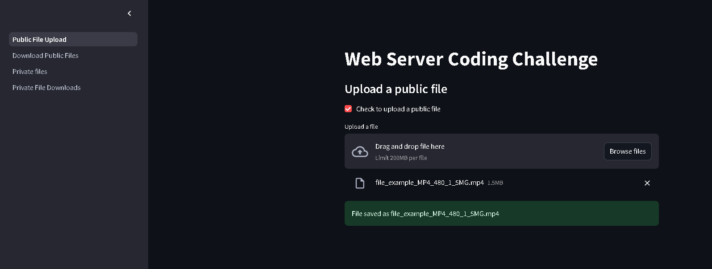
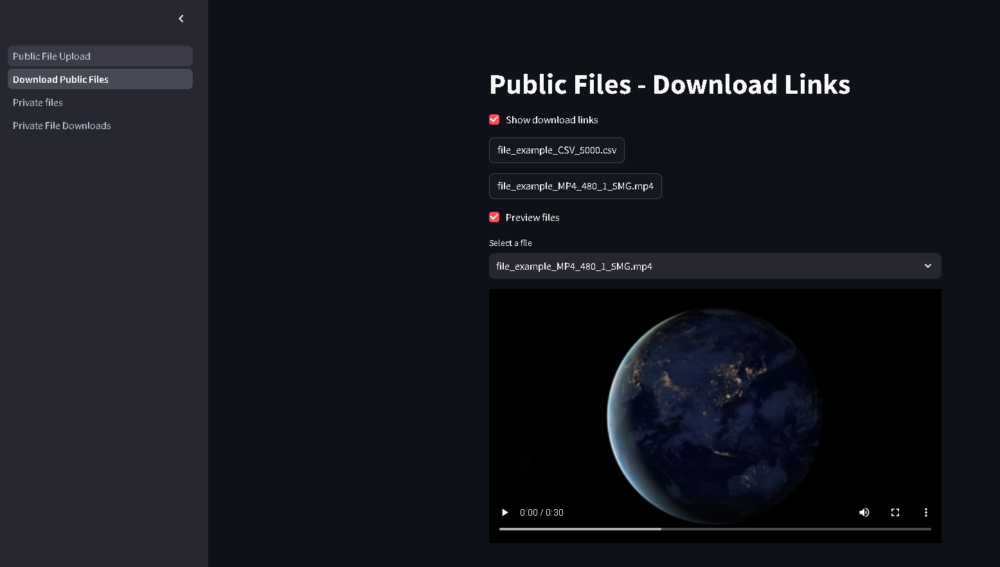

# 🎄 Christmas Coding Challenge 🎄

## Architecture

The web server is built using Streamlit framework. To run the application in most environments, containerization with Docker is used.

Public files are uploaded to the `uploads` directory, and private files are encrypted and uploaded to the `private_uploads` directory.

Public files can be uploaded and downloaded by anyone anonymously.

Preview of public files is also available.
```
Supported file formats for preview:
Image files: jpg, jpeg, png, gif, bmp, tiff, webp
Audio files: mp3, wav, ogg, flac
Video files: mp4, avi, mov, wmv, mkv, webm
Text files: txt, json, csv, xml, html
Other files: pdf, md
```

Private files can only be uploaded by authenticated users. The file is uploaded along with a user-defined passkey.

Authenticated users can download the private files by choosing the file name and entering the passkey. Upon entering the correct passkey, the file is decrypted and available for download.

The `sqldb.db` file is used to store the passkey for private files. This is a SQLite database.

The `fernet.key` file is generated at runtime and it is used to encrypt and decrypt the files in the `private_uploads` directory. This is based on the python implementation of Fernet symmetric encryption algorithm.

The application performs some basic validation checks upon file upload, such as file type and filename.

A default self-signed SSL certificate is used for HTTPS support (data encryption in transit).

# Installation

## 1.Using shell scripts to build and run the Docker image and Docker container (Recommended)

Ensure that Docker is installed and running on your system.

- Clone the repository.
- Navigate to the project directory.
- Provide the permissions to execute the shell scripts.

```bash
chmod +x build.sh
chmod +x run.sh
chmod +x stop.sh
chmod +x delete_image.sh
```
To build the Docker image and run the Docker container:

```bash
./build.sh
./run.sh
```

To stop the Docker container:

```bash
./stop.sh
```

Delete the Docker image:
```bash
./delete_image.sh
```

## 2. To run the Streamlit app locally in a virtual environment - Alternative to Docker

Follow the below steps:

```bash
python3 -m venv venv
source venv/bin/activate
pip install -r requirements.txt
streamlit run Public_File_Upload.py
```
Tested with Python 3.10.12

## Other Useful Information

### Default Credentials

The default username and password are:

- Username: `admin`
- Password: `admin`

To change the default credentials, please modify the `.streamlit/secrets.toml` file in the project directory.

### SSL Certificate

In a development environment, we can use a self-signed SSL certificate for HTTPS support. 

Note: This will generate a warning in the browser.

To remove the existing self-signed SSL certificate and generate a new self-signed SSL certificate, you can use the following commands:

```bash
cd .streamlit
rm -f privkey.pem
rm -f fullchain.pem
openssl req -x509 -nodes -days 365 -newkey rsa:2048 -keyout privkey.pem -out fullchain.pem -subj "/CN=localhost"
```

In a production environment, we should use a valid SSL certificate for HTTPS support.
Alternatively, a reverse proxy like Nginx or cloud-based solutions like AWS Application Load Balancer (ALB) or Azure Application Gateway can be used to terminate SSL connections.

## TO-DO

- The SQLite database can be stored in a secure location where the data will be encrypted at rest.

- The fernet key could be stored securely in a cloud solution like AWS Key Management Service (AWS KMS) or Azure Key Vault and retrieved at runtime using API calls.

- Improve authentication and authorization mechanisms. Add support to allow users to create and manage their own accounts.

- Allow users to delete their own files.

## Preview Images

### Preview of the application

Public file uploads:


Public file previews and download:


Authentication page:
